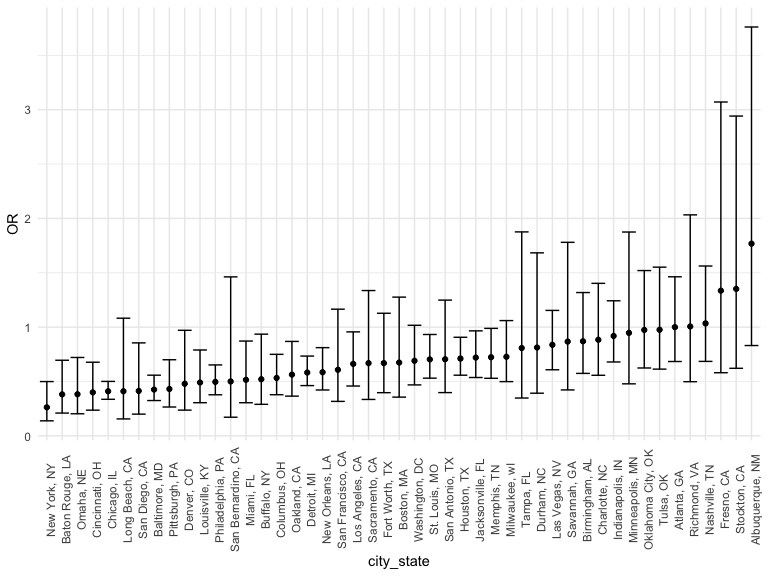
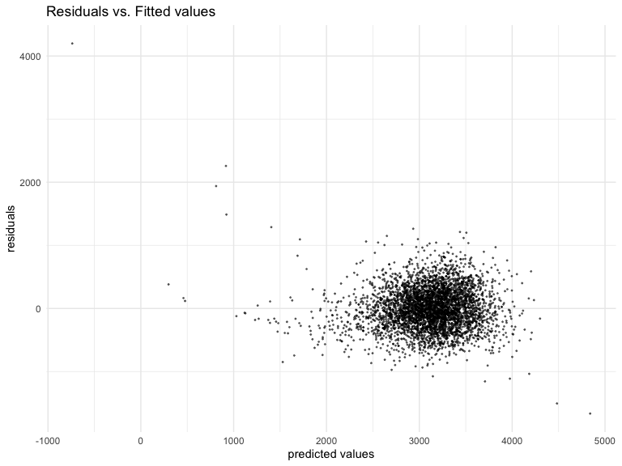
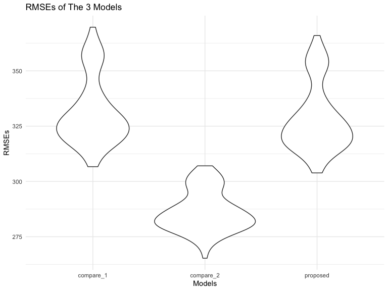

Homework 6
================
Hongji Jiang

# Problem 2

## Import and tidy up the dataset

``` r
homicide_data = read_csv("./data/homicide-data.csv")
```

    ## Rows: 52179 Columns: 12
    ## ── Column specification ────────────────────────────────────────────────────────
    ## Delimiter: ","
    ## chr (9): uid, victim_last, victim_first, victim_race, victim_age, victim_sex...
    ## dbl (3): reported_date, lat, lon
    ## 
    ## ℹ Use `spec()` to retrieve the full column specification for this data.
    ## ℹ Specify the column types or set `show_col_types = FALSE` to quiet this message.

This dataset has 52179 rows and 12 columns. The columns(variables) are
uid, reported_date, victim_last, victim_first, victim_race, victim_age,
victim_sex, city, state, lat, lon, disposition and each row is a
homicide incident.

``` r
homicide_data=
  homicide_data %>%
  mutate(
    city_state = str_c(city, state, sep = ", "),
    solved = ifelse(disposition == "Closed by arrest", 1, 0),
    victim_age = as.numeric(victim_age)
    ) %>%
    filter(city_state != "Dallas, Tx", city_state != "Phoenix, AZ", city_state != "Kansas City, MO", city_state != "Tulsa, AL") %>% 
  filter(victim_race %in% c("Black", "White")) %>% 
  drop_na(victim_age)
```

Created a new variable `city_state` by concatenating city and state,
seperateing with ‘,’. Omitted cities Dallas, TX; Phoenix, AZ; and Kansas
City, MO– these don’t report victim race. Also omitted Tulsa, AL – this
is a data entry mistake.

``` r
logistic_Baltimore = 
  homicide_data %>% 
  filter(city_state == "Baltimore, MD") %>% 
  glm(solved ~ victim_age + victim_sex + victim_race, data = ., family = binomial()) 
```

Use glm on the to fit a lofisitc regression model with resolved vs
unresolved as the outcome and victim age, sex and race as predictors.
Save the output of glm as an R object;

``` r
logistic_Baltimore %>% 
  broom::glance()
```

    ## # A tibble: 1 × 8
    ##   null.deviance df.null logLik   AIC   BIC deviance df.residual  nobs
    ##           <dbl>   <int>  <dbl> <dbl> <dbl>    <dbl>       <int> <int>
    ## 1         3568.    2752 -1746. 3501. 3524.    3493.        2749  2753

Take a glance at the saved result.

``` r
logistic_Baltimore %>% 
  broom::tidy() %>%
  mutate(OR = exp(estimate)) %>%
  mutate(
    lower_ci = exp(estimate-1.96*std.error),
    upper_ci = exp(estimate+1.96*std.error)
  ) %>% 
  filter(term == "victim_sexMale") %>%
  select(term, estimate, OR, lower_ci, upper_ci) %>% 
  knitr::kable(digits = 3)
```

| term           | estimate |    OR | lower_ci | upper_ci |
|:---------------|---------:|------:|---------:|---------:|
| victim_sexMale |   -0.854 | 0.426 |    0.325 |    0.558 |

Use broom tidy to tidy up the result. Get the odds ratio of case being
solved comparing those with sex as male to those with sex as female and
the 95% CI for it.

``` r
logistic_all_cities = function(dataset) {
    dataset %>%
    glm(solved ~ victim_age + victim_sex + victim_race, data = ., family = binomial()) %>% 
    broom::tidy() %>% 
    mutate(
      OR = exp(estimate),
      lower_ci = exp(estimate - 1.96 * std.error),
      upper_ci = exp(estimate + 1.96 * std.error)) %>%
  filter(term == "victim_sexMale") %>%
  select(term, estimate, OR, lower_ci, upper_ci)
}
```

Create a function to fit the regression model and get the odds ratio and
CI similar to the process we have done to Baltimore. It is going to be
applied to the data set in the next steps for each of the cities.

``` r
logit_result_cities = 
  homicide_data %>% 
  nest(df = -city_state) %>% 
  mutate(
    result = map(df, logistic_all_cities)
  ) %>% 
  unnest(result) %>% 
  select(-df) 
```

``` r
logit_result_cities %>% 
  knitr::kable(digits = 3)
```

| city_state         | term           | estimate |    OR | lower_ci | upper_ci |
|:-------------------|:---------------|---------:|------:|---------:|---------:|
| Albuquerque, NM    | victim_sexMale |    0.570 | 1.767 |    0.831 |    3.761 |
| Atlanta, GA        | victim_sexMale |    0.000 | 1.000 |    0.684 |    1.463 |
| Baltimore, MD      | victim_sexMale |   -0.854 | 0.426 |    0.325 |    0.558 |
| Baton Rouge, LA    | victim_sexMale |   -0.964 | 0.381 |    0.209 |    0.695 |
| Birmingham, AL     | victim_sexMale |   -0.139 | 0.870 |    0.574 |    1.318 |
| Boston, MA         | victim_sexMale |   -0.395 | 0.674 |    0.356 |    1.276 |
| Buffalo, NY        | victim_sexMale |   -0.653 | 0.521 |    0.290 |    0.935 |
| Charlotte, NC      | victim_sexMale |   -0.123 | 0.884 |    0.557 |    1.403 |
| Chicago, IL        | victim_sexMale |   -0.891 | 0.410 |    0.336 |    0.501 |
| Cincinnati, OH     | victim_sexMale |   -0.917 | 0.400 |    0.236 |    0.677 |
| Columbus, OH       | victim_sexMale |   -0.630 | 0.532 |    0.378 |    0.750 |
| Denver, CO         | victim_sexMale |   -0.736 | 0.479 |    0.236 |    0.971 |
| Detroit, MI        | victim_sexMale |   -0.541 | 0.582 |    0.462 |    0.734 |
| Durham, NC         | victim_sexMale |   -0.208 | 0.812 |    0.392 |    1.683 |
| Fort Worth, TX     | victim_sexMale |   -0.402 | 0.669 |    0.397 |    1.127 |
| Fresno, CA         | victim_sexMale |    0.289 | 1.335 |    0.580 |    3.071 |
| Houston, TX        | victim_sexMale |   -0.341 | 0.711 |    0.558 |    0.907 |
| Indianapolis, IN   | victim_sexMale |   -0.085 | 0.919 |    0.679 |    1.242 |
| Jacksonville, FL   | victim_sexMale |   -0.329 | 0.720 |    0.537 |    0.966 |
| Las Vegas, NV      | victim_sexMale |   -0.178 | 0.837 |    0.608 |    1.154 |
| Long Beach, CA     | victim_sexMale |   -0.891 | 0.410 |    0.156 |    1.082 |
| Los Angeles, CA    | victim_sexMale |   -0.413 | 0.662 |    0.458 |    0.956 |
| Louisville, KY     | victim_sexMale |   -0.712 | 0.491 |    0.305 |    0.790 |
| Memphis, TN        | victim_sexMale |   -0.324 | 0.723 |    0.529 |    0.988 |
| Miami, FL          | victim_sexMale |   -0.663 | 0.515 |    0.304 |    0.872 |
| Milwaukee, wI      | victim_sexMale |   -0.319 | 0.727 |    0.499 |    1.060 |
| Minneapolis, MN    | victim_sexMale |   -0.054 | 0.947 |    0.478 |    1.875 |
| Nashville, TN      | victim_sexMale |    0.034 | 1.034 |    0.685 |    1.562 |
| New Orleans, LA    | victim_sexMale |   -0.536 | 0.585 |    0.422 |    0.811 |
| New York, NY       | victim_sexMale |   -1.338 | 0.262 |    0.138 |    0.499 |
| Oakland, CA        | victim_sexMale |   -0.574 | 0.563 |    0.365 |    0.868 |
| Oklahoma City, OK  | victim_sexMale |   -0.026 | 0.974 |    0.624 |    1.520 |
| Omaha, NE          | victim_sexMale |   -0.961 | 0.382 |    0.203 |    0.721 |
| Philadelphia, PA   | victim_sexMale |   -0.701 | 0.496 |    0.378 |    0.652 |
| Pittsburgh, PA     | victim_sexMale |   -0.842 | 0.431 |    0.265 |    0.700 |
| Richmond, VA       | victim_sexMale |    0.006 | 1.006 |    0.498 |    2.033 |
| San Antonio, TX    | victim_sexMale |   -0.350 | 0.705 |    0.398 |    1.249 |
| Sacramento, CA     | victim_sexMale |   -0.402 | 0.669 |    0.335 |    1.337 |
| Savannah, GA       | victim_sexMale |   -0.143 | 0.867 |    0.422 |    1.780 |
| San Bernardino, CA | victim_sexMale |   -0.692 | 0.500 |    0.171 |    1.462 |
| San Diego, CA      | victim_sexMale |   -0.884 | 0.413 |    0.200 |    0.855 |
| San Francisco, CA  | victim_sexMale |   -0.498 | 0.608 |    0.317 |    1.165 |
| St. Louis, MO      | victim_sexMale |   -0.352 | 0.703 |    0.530 |    0.932 |
| Stockton, CA       | victim_sexMale |    0.301 | 1.352 |    0.621 |    2.942 |
| Tampa, FL          | victim_sexMale |   -0.214 | 0.808 |    0.348 |    1.876 |
| Tulsa, OK          | victim_sexMale |   -0.025 | 0.976 |    0.614 |    1.552 |
| Washington, DC     | victim_sexMale |   -0.371 | 0.690 |    0.468 |    1.017 |

``` r
logit_result_cities %>% 
  mutate(
    city_state = fct_reorder(city_state, OR)
  ) %>% 
  ggplot(aes(x = city_state, y = OR)) +
  geom_point() +
  geom_errorbar(aes(ymin = lower_ci, ymax = upper_ci)) +
  theme(axis.text.x = element_text(
      angle = 90)) 
```


Run glm on each city_state and get the Odds Ratio of case being solved
comparing those with sex as male to those with sex as female, and also
get the CI of that OR. Using geom_error bar to show the OR and the CI
together in one plot. We can see that New York, NY has the smallest odds
ratio of solving homicides comparing those identified as male to those
identified as female. And Albuquerque, NM has the highest odds ratio of
solving homicides comparing those identidied as male to those identified
as female.

# Question 3

``` r
birthweight_data = 
  read_csv("./data/birthweight.csv") %>% 
    mutate(
    frace = as.factor(frace),
    malform = as.factor(malform),
    mrace = as.factor(mrace),
    babysex = as.factor(babysex)
    ) %>%
  drop_na()
```

    ## Rows: 4342 Columns: 20
    ## ── Column specification ────────────────────────────────────────────────────────
    ## Delimiter: ","
    ## dbl (20): babysex, bhead, blength, bwt, delwt, fincome, frace, gaweeks, malf...
    ## 
    ## ℹ Use `spec()` to retrieve the full column specification for this data.
    ## ℹ Specify the column types or set `show_col_types = FALSE` to quiet this message.

``` r
proposed_model = lm(bwt ~ fincome+blength+gaweeks, data = birthweight_data)
```

The proposed model I have is using using family monthly income (in
hundreds, rounded), length at birth and gestational age as predictors.

``` r
proposed_model %>%
  broom::tidy() %>% 
  knitr::kable(digits = 3)
```

| term        |  estimate | std.error | statistic | p.value |
|:------------|----------:|----------:|----------:|--------:|
| (Intercept) | -4335.835 |    97.169 |   -44.622 |       0 |
| fincome     |     1.658 |     0.194 |     8.528 |       0 |
| blength     |   127.822 |     1.976 |    64.703 |       0 |
| gaweeks     |    25.818 |     1.710 |    15.098 |       0 |

``` r
proposed_plot =
  birthweight_data %>% 
  modelr::add_residuals(proposed_model) %>%
  modelr::add_predictions(proposed_model) %>% 
  ggplot(aes(x = pred, y = resid)) + 
  geom_point(alpha = 0.5, cex=0.3) +
  labs(
    title = "Residuals vs. Fitted values",
    x = "predicted values",
    y = "residuals")
proposed_plot
```



``` r
cv_df = crossv_mc(birthweight_data, 100)
cv_df =
  cv_df %>% 
  mutate(
    train = map(train, as_tibble),
    test = map(test, as_tibble))
cv_df = 
  cv_df %>% 
  mutate(proposed = map(train, ~lm(bwt ~ fincome+blength+gaweeks, data = birthweight_data)),
         compare_1 = map(train, ~lm(bwt ~ blength+gaweeks, data = birthweight_data)),
         compare_2  = map(train, ~lm(bwt ~ bhead + blength + babysex+ bhead*babysex + blength*babysex + bhead*blength + bhead*blength*babysex, data = birthweight_data))) %>%
  mutate(rmse_proposed = map2_dbl(proposed, test, ~rmse(model = .x, data = .y)),
         rmse_compare_1 = map2_dbl(compare_1, test, ~rmse(model = .x, data = .y)),
         rmse_compare_2 = map2_dbl(compare_2, test, ~rmse(model = .x, data = .y)))
cv_df
```

    ## # A tibble: 100 × 9
    ##    train    test     .id   proposed compare_1 compare_2 rmse_p…¹ rmse_…² rmse_…³
    ##    <list>   <list>   <chr> <list>   <list>    <list>       <dbl>   <dbl>   <dbl>
    ##  1 <tibble> <tibble> 001   <lm>     <lm>      <lm>          338.    340.    288.
    ##  2 <tibble> <tibble> 002   <lm>     <lm>      <lm>          316.    318.    279.
    ##  3 <tibble> <tibble> 003   <lm>     <lm>      <lm>          332.    336.    286.
    ##  4 <tibble> <tibble> 004   <lm>     <lm>      <lm>          309.    312.    265.
    ##  5 <tibble> <tibble> 005   <lm>     <lm>      <lm>          315.    320.    284.
    ##  6 <tibble> <tibble> 006   <lm>     <lm>      <lm>          322.    326.    283.
    ##  7 <tibble> <tibble> 007   <lm>     <lm>      <lm>          328.    328.    286.
    ##  8 <tibble> <tibble> 008   <lm>     <lm>      <lm>          338.    342.    286.
    ##  9 <tibble> <tibble> 009   <lm>     <lm>      <lm>          317.    319.    291.
    ## 10 <tibble> <tibble> 010   <lm>     <lm>      <lm>          320.    322.    286.
    ## # … with 90 more rows, and abbreviated variable names ¹​rmse_proposed,
    ## #   ²​rmse_compare_1, ³​rmse_compare_2

``` r
cv_df %>% 
  select(starts_with("rmse")) %>% 
  pivot_longer(
    everything(),
    names_to = "model", 
    values_to = "rmse",
    names_prefix = "rmse_") %>% 
  ggplot(aes(x = model, y = rmse)) + 
  geom_violin() +
  labs(
    title = "RMSEs of The 3 Models",
    x = "Models",
    y = "RMSEs"
  )
```


We can see the model compare_1 that using length at birth and
gestational age as predictors (main effects only) has the largest RMSEs.
And the model compare_2 that using head circumference, length, sex, and
all interactions (including the three-way interaction) between these has
the smallest RMSE of the three models.
